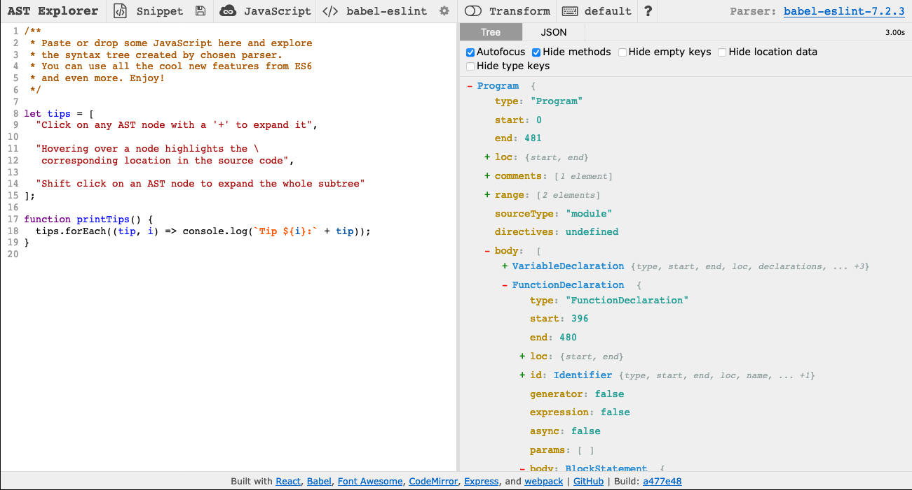
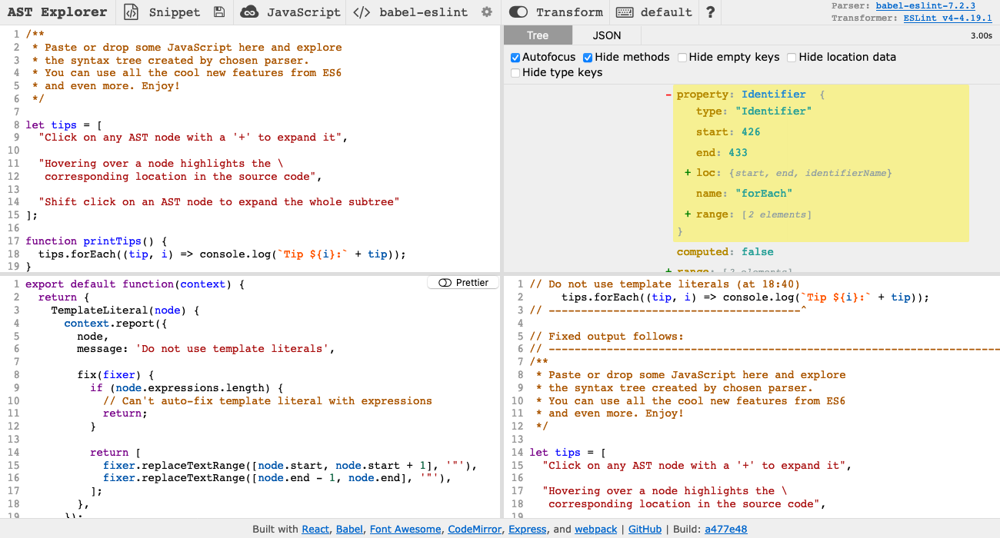

## Table of contents

* [Introduction](#introduction)
* [Write rules](#write-rules)
  * [Hello world](#hello-world)
    * [A note on undecidability](#a-note-on-undecidability)
    * [Examine the AST](#examine-the-ast)
    * [Design the rule](#design-the-rule)
    * [Write the rule](#write-the-rule)
    * [Add the rule to Oppia](#add-the-rule-to-oppia)
    * [Run the linter with the new rule](#run-the-linter-with-the-new-rule)
  * [Beyond hello world](#beyond-hello-world)
    * [Placeholders](#placeholders)
    * [Navigating the AST](#navigating-the-ast)
* [Write tests](#write-tests)

## Introduction

We use [ESLint](https://eslint.org) to lint our JavaScript and TypeScript files. While ESLint comes with a ton of built-in rules that we can use, we sometimes need to write our own. This guide will cover how to write these custom ESLint rules and how to test them.

## Write rules

ESLint parses the code being linted into an [abstract syntax tree (AST)](https://en.wikipedia.org/wiki/Abstract_syntax_tree), and our custom rules operate on this AST. To define our rule, we provide functions to be called on various kinds of nodes in the AST. These functions can then report lint errors.

To understand how ASTs and linters work, we recommend that you use [AST Explorer](https://astexplorer.net) to view the AST for your code. You should select "JavaScript" as the language and "babel-eslint" as the parser. Unless you want to write your linter code in AST Explorer, disable the "Transform" option. Your AST Explorer window should look like this:



To write your lint rule in AST Explorer, select "ESLint v4" under the "Transform" option:



### Hello world

To get a better idea for how lint checks work, write a simple ESLint rule that forbids the string `Hello, world!`. Maybe you don't want people accidentally opening PRs that include code that prints `Hello, world!` from when they were learning JavaScript. First consider what kinds of code should violate the rule. Here are some examples:

```js
const s = "Hello, world!";

console.log("Hello, world!");
```

#### A note on undecidability

While ESLint parses the code being linted, it does not execute it. This means that no lint rule will be able to prevent `Hello, world!` from being printed. No matter how complicated our lint rule, a devious programmer will always be able to construct some convoluted code that evades the rule. For example, code like this will pass our linter:

```js
console.log(`Hello, ${"world"}!`)
```

It turns out that it is provably impossible for us to write a program that can determine whether a program prints `Hello, world!` with perfect accuracy. To see why, suppose for the sake of argument we had a linter `printsHelloWorld()` that accepted the source code of a program and returned a boolean indicating whether the program prints `Hello, world!`. If such a linter existed, we could write the following program, whose source code we'll call `src`:

```js
if (!printsHelloWorld(src)) {
  console.log('Hello, world!');
}
```

No matter what `printsHelloWorld(src)` returns, it's wrong! If it returns `true`, then the program exits without printing `Hello, world!`, but if it returns `false`, then the program does print `Hello, world!`. The only other alternative is for `printsHelloWorld(src)` to run forever and never return anything, which really isn't useful. Since this argument would work for any linter `printsHelloWorld()`, no such linter can exist. This is a variation of the halting problem, which is one of the most famous examples of undecidable problems in computability theory.

This argument is somewhat esoteric, but it has important implications for writing linter rules. **If you want to prevent code that behaves a certain way, any linter you write must miss some code that performs the undesired behavior, raise an error on benign code, or both.** Since we can't write a perfect linter, don't worry about trying to handle cases where a programmer is trying to circumvent your rule. Instead, focus on writing a rule to cover the ways developers normally write code.

#### Examine the AST

To develop an intuition for how ASTs work, copy the examples of code we want our linter to catch into AST Explorer. The AST should look like this:


If you click on the two `Hello, world!` strings, the associated parts of the AST will be highlighted. Notice that both are described by a node like this:

```json
{
  "type": "Literal",
  "start": 8,
  "end": 23,
  "loc": {
    "start": {
      "line": 1,
      "column": 8
    },
    "end": {
      "line": 1,
      "column": 23
    }
  },
  "extra": {
    "rawValue": "Hello, world!",
    "raw": "\"Hello, world!\""
  },
  "value": "Hello, world!",
  "range": [
    8,
    23
  ],
  "_babelType": "StringLiteral",
  "raw": "\"Hello, world!\""
}
```

Note that the numbers will be different since they specify the location of the node in the file.

#### Design the rule

Suppose you decide to write a rule that raises an error whenever it finds a node that:

* is of type "Literal"
* has value "Hello, world!"

After designing any rule, it's important to consider what benign code it will raise errors on (false positives) and what bad code it will miss (false negatives). For our rule:

* False positives

  * Code that includes the string `Hello, world!` but doesn't print it will still raise errors. There probably aren't any good reasons to do this though.

* False negatives

  * Code that constructs the string `Hello, world!` instead of including it as a literal will pass the lint check. This is an acceptable imperfection though since developers are almost always going to use the string literal when writing a hello world program.

#### Write the rule

To write the rule, enable "Transform" on AST Explorer.

ESLint rules are defined as functions that return objects. The returned objects have keys for different types of nodes, and each key maps to a function that checks whether a node of that type violates the rule. In our case, we want to check whether nodes of type `Literal` have a `value` attribute equal to `Hello, world!`, so we can write this rule in AST Explorer's bottom-left panel:

```js
export default function(context) {
  return {
    Literal: function(node) {
      if (node.value === "Hello, world!") {
        context.report({
          node,
          message: 'Do not use "Hello, world!" strings',
        });
      }
    }
  };
};
```

Notice that the node we are examining gets passed into our function and that we report errors by calling `context.report`. In the lower right on AST Explorer, you can see that this lint rule works as expected:


#### Add the rule to Oppia

To add the rule to Oppia's suite of lint checks, we need to add some more metadata describing each problem the rule can find. For our hello world rule, we would create a JavaScript file in `scripts/linters/custom_eslint_checks/rules/hello-world.js` with the following code:

```js
'use strict';

module.exports = {
  meta: {
    type: 'problem',
    docs: {
      description: '"Hello, world!" strings should not be used',
      category: 'Best Practices',
      recommended: true,
    },
    fixable: null,
    schema: [],
    messages: {
      helloWorld: 'Do not use "Hello, world!" strings',
    },
  },

  create: function(context) {
    return {
      Literal: function(node) {
        if (node.value === "Hello, world!") {
          context.report({
            node: node,
            messageId: 'helloWorld',
          });
        }
      }
    };
  }
};
```

First, consider the `meta` key at the top of the exported object. The associated object contains the rule's metadata. Under `docs` we describe the rule, and under `messages` we list the error messages that this rule can raise. ESLint supports rules that suggest fixes, but since we can't automatically fix a `Hello, world!` usage, we set `fixable` to `null`.

Next, consider the `create` key. This key maps to the function we wrote in AST Explorer. However, notice that the values passed to `context.report()` have changed. Instead of specifying the error message directly, it's better to reference a message from the rule's metadata.

We also need to add our rule to `.eslintrc`. Add `"oppia/hello-world": "error",` under the top-level `rules` key.

#### Run the linter with the new rule

To run the linter with your new rule, follow these steps:

1. Delete the `node_modules/eslint-plugin-oppia/` directory so that in the next steps, the lint rules get re-installed.

2. Run `yarn install` to install the custom rules, including the one you just wrote.

3. Execute the pre-commit linter, which will use your new rule. To speed up the lint checks, we recommend running the rule on just a single file when testing it. If you created a `test.js` file with some code to try linting, you would run the linter like this:

   ```console
   $ python -m scripts.linters.pre_commit_linter --path test.js
   ...
   ----------------------------------------
   Please fix the errors below:
   ----------------------------------------
   ...
   /oppia/test.js
     2:11    Do not use "Hello, world!" strings  oppia/hello-world

   ✖ 1 problem (1 error, 0 warnings)


   ---------------------------
   Checks Not Passed.
   ---------------------------
   ```

   Note that you might see other lint errors too. Those are fine to ignore.

### Beyond hello world

ESLint has many more features described in the [ESLint documentation](https://eslint.org/docs/developer-guide/working-with-rules). In particular, you may find the following features useful:

#### Placeholders

Your error messages can have [placeholders](https://eslint.org/docs/developer-guide/working-with-rules#using-message-placeholders) that are filled by the data you pass to `context.report()`. For example, you might have an error message like this:

```js
literals: 'Please do not use "{{stringValue}}" literals.'
```

Then you could call `context.report()` like this:

```js
context.report({
  node: node,
  messageId: 'literals',
  data: {
    stringValue: node.value,
  },
})
```

The value of `node.value` will be substituted in place of `{{stringValue}}`.

#### Navigating the AST

You'll often want to move up or down the AST to check neighboring nodes. For example, suppose you want to forbid calling `console.log()`. `console` and `log` are different nodes, and you need to check both. Here's an abbreviated version of the AST for `console.log()`:

```json
{
  "callee": {
    "type": "MemberExpression",
    ...
    "object": {
      "type": "Identifier",
      ...
      "name": "console",
      ...
    },
    "property": {
      "type": "Identifier",
      ...
      "name": "log",
      ...
    },
    ...
  },
}
```

You could identify this pattern by specifying a function to run on all nodes of type `MemberExpression`. Inside your function, you could then check that `node.object.name === "console"` and `node.property.name === "log"`.

It is also possible to work up the AST by calling `context.getAncestors()`. This call will return an array of all the ancestors of the current node.

## Write tests

Along with every new rule you write, you should include a `*spec.js` file with tests for that rule. ESLint provides a handy [RuleTester](https://eslint.org/docs/developer-guide/nodejs-api#ruletester) utility to make testing easier.

The tests for our hello world rule might look like this:

```js
'use strict';

var rule = require('./hello-world');
var RuleTester = require('eslint').RuleTester;

var ruleTester = new RuleTester();
ruleTester.run('hello-world', rule, {
  valid: [
    {
      code: 'var s = 0;'
    },
    {
      code: 'var s = "Hello, " + "world!"'
    },
  ],

  invalid: [
    {
      code: 'var s = "Hello, world!"',
      errors: [{
        message: 'Do not use "Hello, world!" strings'
      }],
    },
    {
      code: 'console.log("Hello, world!")',
      errors: [{
        message: 'Do not use "Hello, world!" strings'
      }],
    },
  ]
});
```

Pay attention to the parts after `valid` and `invalid`. `valid` maps to a list of objects. Each object has one key, `code`, whose value is a string containing the code to lint. The linter will be expected to raise no errors on this code.

`invalid` maps to another list of objects that have `code` and `errors` properties. `code` maps to a string to lint, and `errors` maps to a list of objects, where each object describes an error that should be raised when linting the code. You will probably only need to specify the `message` of the error, but you can find more options in the [documentation](https://eslint.org/docs/developer-guide/nodejs-api#ruletester).

As you write your tests, think back to when you designed your rule. You should write cases for:

* True positives: Bad code that you expect to result in lint errors.
* True negatives: Good code that you don't expect to result in lint errors.
* False positives: Good code that you expect to result in lint errors because you can't write a perfect linter.
* False negatives: Bad code that you don't expect to result in lint errors because the linter is imperfect.

Once you have written your tests, you can run them like this:

```console
python -m scripts.run_custom_eslint_tests
```
