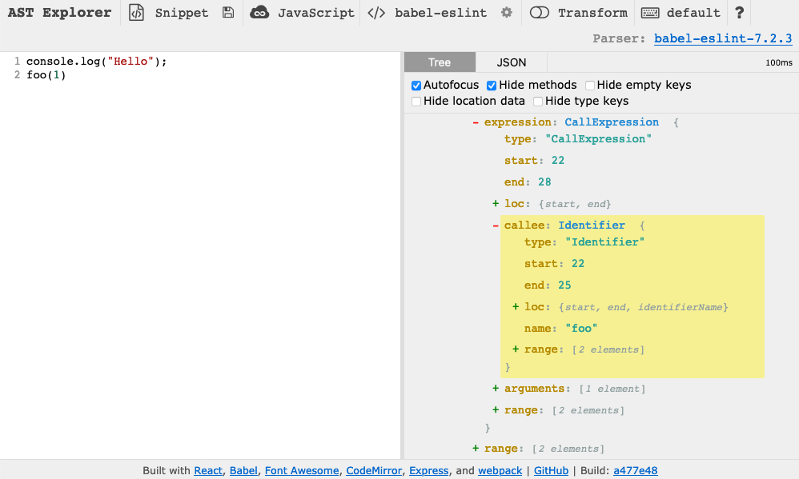

## Table of contents

* [Introduction](#introduction)
* [Print statements](#print-statements)
* [Inspect the AST](#inspect-the-ast)

## Introduction

Especially for complex lint rules, it can be hard to figure out why a test failed. This page will give you some tips to help you debug your failing tests.

## Print statements

If you add a `console.log()`, `console.error()`, or `console.info()` statement to your custom ESLint rule code, the output will appear along with the test status output. For example, suppose we have a lint rule that raises an error every time `.click()` or `.sendKeys()` is called on an object instead of `action.click()` or `action.sendKeys()`, which we would like people to use instead. If we add `console.log()` statement to print `DEBUGGING found lint error` whenever our lint rule raises an error, we see this output when running the tests:

```text
  e2e-action
    valid
      ✓ it('should test a feature', function() {
        action.click("Element", elem);
      });
      ✓ it('should test a feature', function() {
        action.sendKeys("Element", elem, "keys");
      });
      ✓ it('should test a feature', function() {
        console.log(elem.click);
      });
      ✓ it('should test a feature', function() {
        console.log(elem.sendKeys);
      });
    invalid
DEBUGGING found lint error
      ✓ it('should test a feature', function() {
        elem.click();
      });
DEBUGGING found lint error
      ✓ it('should test a feature', function() {
        elem.sendKeys("keys");
      });
DEBUGGING found lint error
DEBUGGING found lint error
      ✓ it('should test a feature', function() {
        element(by.css('.protractor-test')).click();
      });
      ✓ it('should test a feature', function() {
        element(by.css('.protractor-test')).sendKeys("keys");
      });
```

There are a few important points right away:

* All the tests are named `should test a feature`. This is because we generate tests dynamically based on the test cases you provide in your `*.spec.js` file. If you are used to using `fit` to run a single frontend test in isolation, this dynamic test generation means that `fit` won't work.
* Our debugging statements don't appear in a consistent place with respect to the test status report. For example, the debugging output for the last test appears grouped with the output from the second-to-last test. You shouldn't assume that output from your debugging statements will be synchronized with the test status messages.

These points make debugging a little more difficult, but there's an easy fix: Comment-out all the tests in your `*.spec.js` file except one that you want to debug. Then you'll know that all the debugging statements came from that one test.

## Inspect the AST

If you are confused about why your linter is raising or not raising an error on a particular test case, we recommend copying your test case into [AST Explorer](https://astexplorer.net) and examining the AST (abstract syntax tree). Then you can use [print statements](#print-statements) in your linter code to examine the AST nodes being visited.

For example, suppose we have this rule to forbid `console.log()` statements:

```js
export default function(context) {
  return {
    CallExpression(node) {
      console.log(
        `Considering node starting at line ${node.loc.start.line}`);
      if (
        node.callee.object.name == 'console' &&
        node.callee.property.name == 'log'
      ) {
        context.report({
          node,
          message: 'Do not use console.log()',
        });
      }
    }
  };
};
```

Now, suppose we run our lint rule on the following test case:

```js
console.log("Hello");
foo(1)
```

The test fails with:

```text
Considering node starting at line 1
Considering node starting at line 2
TypeError: node.callee.object is undefined
```

This tells us that the error occurs on the second line of the test code. If we copy this test case into AST Explorer, we can see that `foo(1)` is a `CallExpression` but its `callee` attribute has no `object` attribute:



This is why we're getting that error! We could fix this problem by checking that `callee` has the `object` and `property` attributes at the start of our rule.
