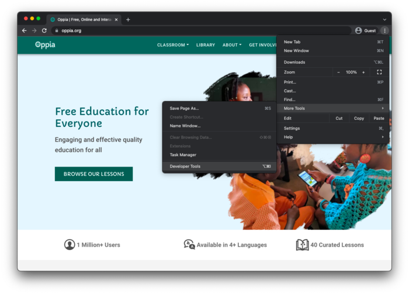
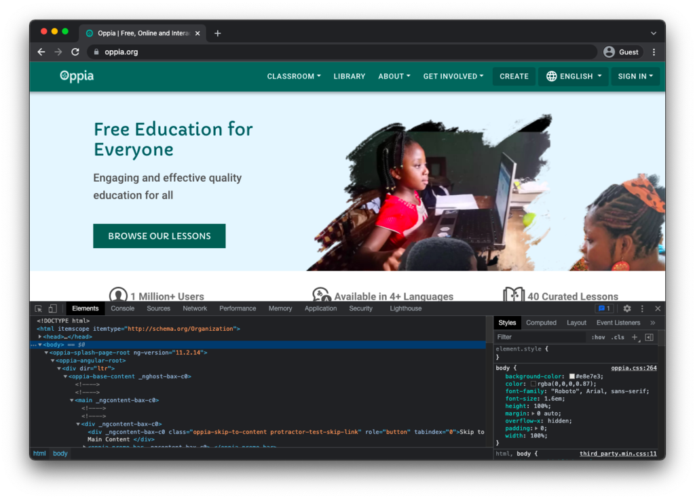
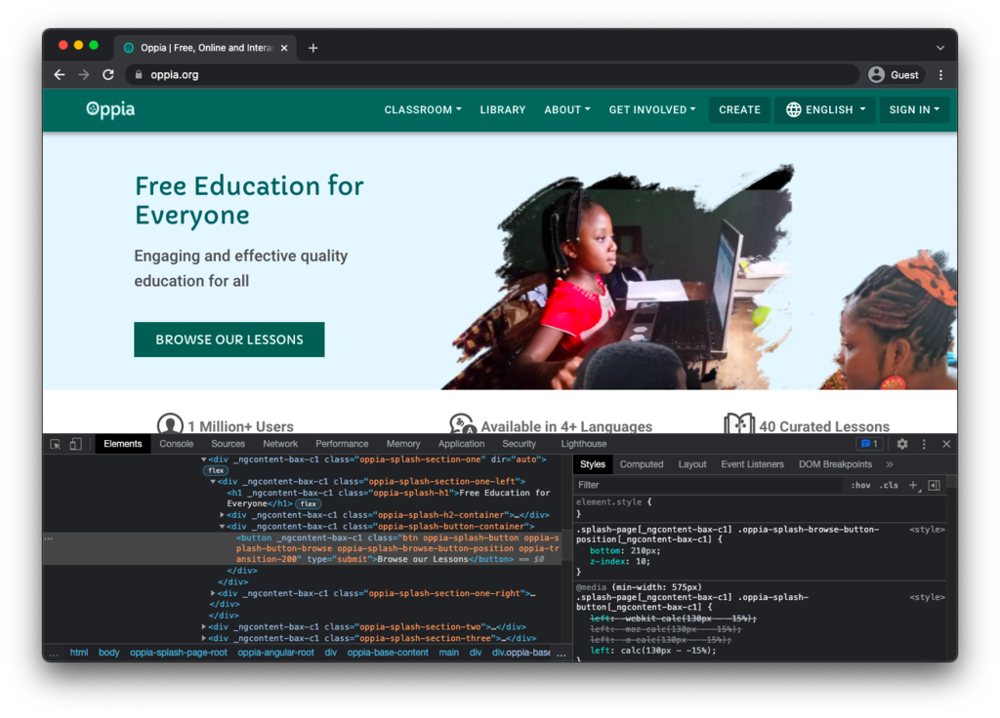
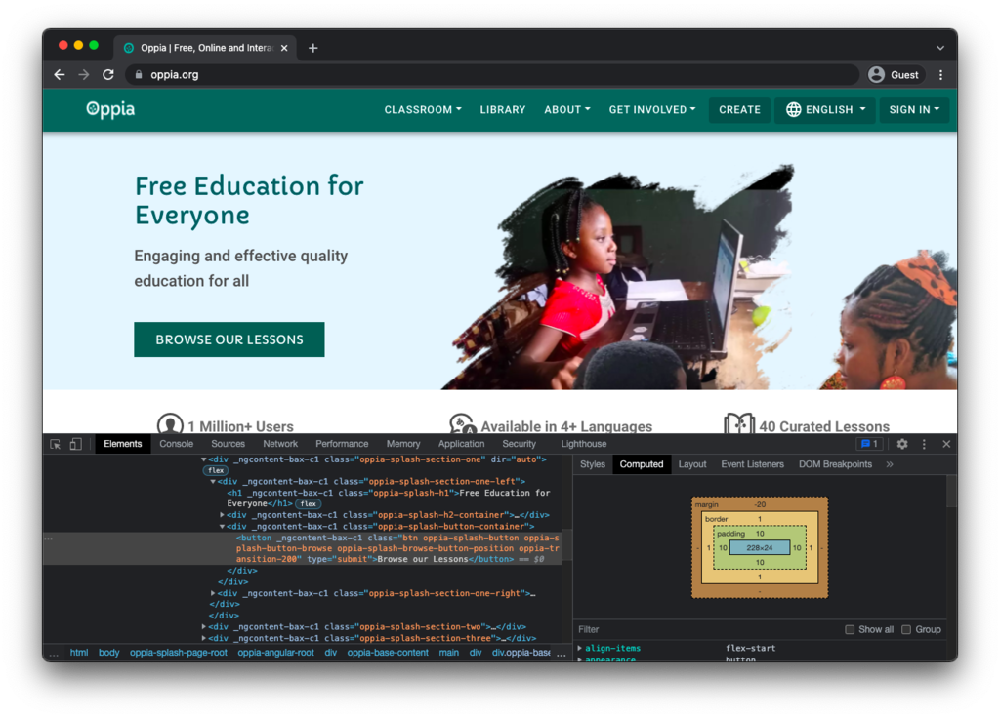
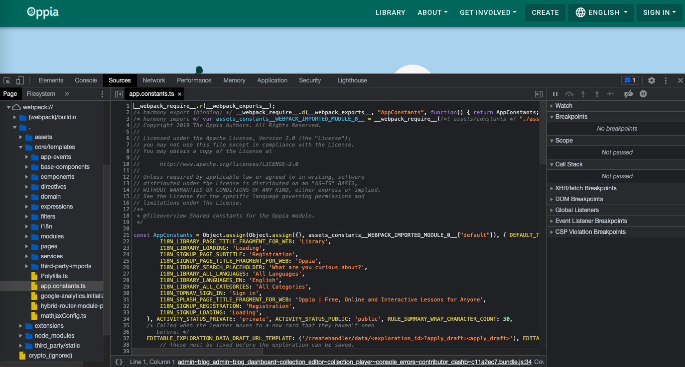

## Table of contents

* [Introduction](#introduction)
* [Chrome developer tools](#chrome-developer-tools)
  * [Elements tab](#elements-tab)
  * [Console tab](#console-tab)
  * [Sources tab](#sources-tab)

## Introduction

As part of Oppia's [[build process|Build-process]], the frontend code gets bundled and (in prod mode) minified. This build process can complicate debugging, but here we will describe some strategies to help you diagnose problems in the frontend code.

## Chrome developer tools

The [Chrome developer tools](https://developer.chrome.com/docs/devtools/) are invaluable for debugging. You can load them by clicking on the three dots in the upper-right of the browser window, then selecting "More Tools," and finally selecting "Developer Tools" like this:



You should see the developer tools open:



Note that these tools work on any website, not just your local development server. For example, in the screenshot above we have https://oppia.org open. This means you can use the developer tools to compare the Oppia app you are running locally to what is currently running in production.

### Elements tab

The "Elements" tab of the developer tools lets you inspect the HTML and CSS of a page.

1. Click on the element selector button in the upper-left of the developer tools:

   

2. Now when you hover over elements on the page, you'll see colored boxes that indicate the element boundaries, padding, border, and margins. You'll also see the HTML for that element highlighted in the debugging tools. For example, here we are inspecting the "Browse our lessons" button:

   

   If we click on the element, we that on the right, the "Styles" sub-tab shows the CSS describing the inspected element:

   

   We can also view sizing information by clicking on the "Computed" sub-tab:

   

### Console tab

In the "Console" tab, you can run JavaScript code to interact with the page. For example, here we use the HTML class `oppia-splash-button-browse` to select some buttons on the page and print the first one's text:


Notice that in the screenshot above, we are hovering over the HTML returned by `$('.oppia-splash-button-browse')[0]`, which is why the associated element on the page is highlighted.

This tab is also where you'll see the output from `console.log()`, `console.error()`, or other print statements.

### Sources tab

If you select `webpack://` in the sidebar of the sources tab, you can see Oppia's frontend code:



However, here you are seeing the code that has been altered by the build process. To see the original source code, you need to enable source maps when running the development server like this:

```console
python -m scripts.start --source_maps
python -m scripts.run_e2e_tests --prod_env --source_maps
```

When generated, source maps will automatically be available through the Chrome debugger:


