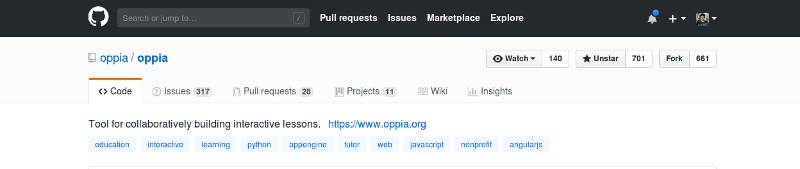
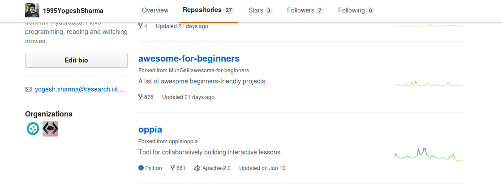
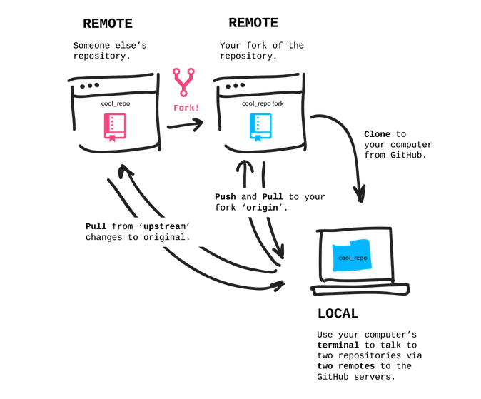

Before working through these instructions, you should read through our [[instructions for code contributors|Contributing-code-to-Oppia]]. Once you've done that, you're ready to start installing Oppia!

1. Create a new, empty folder. We'll call it `opensource/`.

1. Navigate to the folder (`cd opensource/`). Next, we'll [fork and clone](https://help.github.com/articles/fork-a-repo/) the Oppia repository.

1. Navigate to https://github.com/oppia/oppia and click on the `fork` button. It is placed on the right corner opposite the repository name `oppia/oppia`.

   

   You should now see Oppia under your repositories. It will be marked as forked from `oppia/oppia`.

   

1. Clone the repository to your local computer (replacing the values in `{{}}`):

   ```console
   $ git clone https://github.com/{{GITHUB USERNAME}}/oppia.git
   Cloning into 'oppia'...
   remote: Enumerating objects: 203313, done.
   remote: Total 203313 (delta 0), reused 0 (delta 0), pack-reused 203313
   Receiving objects: 100% (203313/203313), 179.26 MiB | 3.12 MiB/s, done.
   Resolving deltas: 100% (155851/155851), done.
   Updating files: 100% (4199/4199), done.
   ```

   Note that you will see slightly different output because the numbers change as Oppia grows.

1. Now your `origin` remote is pointing to your fork (`{{GITHUB USERNAME}}/oppia`). To stay up to date with the main `oppia/oppia` repository, add it as a remote called `upstream`. You'll first need to move into the `oppia` directory that was created by the clone operation.

   ```console
   $ cd oppia
   $ git remote add upstream https://github.com/oppia/oppia.git
   $ git remote -v
   origin     https://github.com/U8NWXD/oppia.git (fetch)
   origin     https://github.com/U8NWXD/oppia.git (push)
   upstream   https://github.com/oppia/oppia.git (fetch)
   upstream   https://github.com/oppia/oppia.git (push)
   ```

   The `git remote -v` command at the end shows all your current remotes.

   Now you can pull in changes from `oppia/oppia` by running `git pull upstream {{branch}}` and push your changes to your fork by running `git push origin {{branch}}`.

   We have established a clean setup now. We can make any changes we like and push it to this forked repository, and then make a pull request for getting the changes merged into the original repository. Here's a nice picture explaining the process ([image source](https://github.com/Rafase282/My-FreeCodeCamp-Code/wiki/Lesson-Save-your-Code-Revisions-Forever-with-Git)).

   

   For making any changes to original repository, we first sync our cloned repository with original repository. We merge develop with `upstream/develop` to do this. Now we make a new branch, do the changes on the branch, push the branch to forked repository, and make a PR from Github interface. We use a different branch to make changes so that we can work on multiple issues while still having a clean version in develop branch.

1. Next, follow the instructions for your platform:

   * [[Linux|Installing-Oppia-(Linux)]]

   * [[Mac OS|Installing-Oppia-(Mac-OS)]]

   * [[Windows|Installing-Oppia-(Windows)]]

1. If you run into any problems during installation, please read [[these notes|Issues-with-installation?]] and the [[troubleshooting page|Troubleshooting]]. We're also [[here to help|Get-help]].
