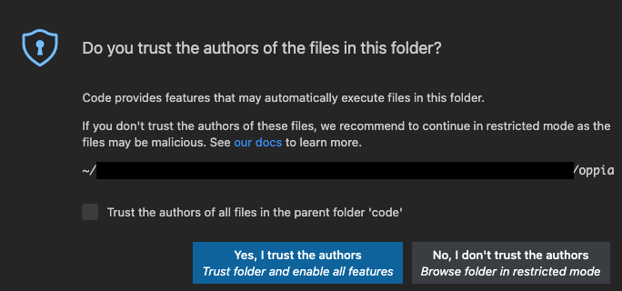
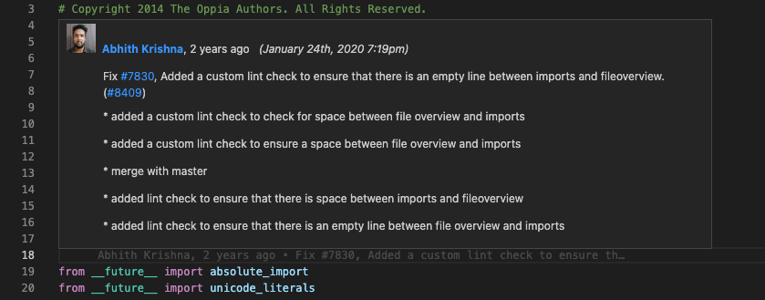
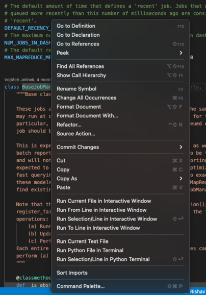
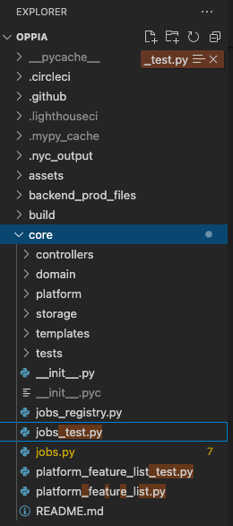

**A word of warning: Many code editors let you perform git actions from their graphical interfaces instead of through the command line. We strongly recomment that you use the command line instead. Many new contributors run into trouble because their editor's git interface is incorrectly configured.**

## Table of Contents

* [Visual Studio Code](#visual-studio-code)
* [Sublime](#sublime)
* [Atom](#atom)

## Visual Studio Code

If you are brand-new to Visual Studio Code, you can watch some [introductory videos](https://code.visualstudio.com/docs/getstarted/introvideos) to get started.

To set up Oppia:

1. Open the root `oppia/` folder in Code.

2. You may be asked whether you trust the Oppia developers.

   

   The code in the Oppia repository is safe to run, so you can click "yes." However, you can also edit code just fine if you click "no." You'll be in "restricted mode," which disables some features. If you ever find you need those features, you can change your trust settings later.

3. You can navigate the files of the Oppia repository using the file tree on the left. Click on folders to show their contents, and click on files to open them in the editor that takes up the center of the window. On the far right is the minimap, which shows the file contents in small font so you can see more of the file at once.

   

4. To edit the file, just start typing!

Tips:

* Code has lots of extensions you can install. Here are some we find useful:

  * `GitLens` gives you easy access to git information about your files. One particularly helpful feature shows the last commit to modify the line your cursor is on. If you hover over the annotation, GitLens shows more information about the commit.

    

  * `Python` provides improved language support for Python. JavaScript and TypeScript support are built-in to Code. To configure the extension, we need to:

    * Set the `PYTHONPATH` environment variable. In a `.env` file at the root of the `oppia/` repository, add these lines:

      ```text
      PYTHONPATH=../oppia_tools/pylint-1.9.5/:../oppia_tools/pylint-quotes-0.1.8/
      ```

    * Set the following settings in the `.vscode/settings.json` file:

      ```json
      {
        "python.linting.pylintEnabled": true,
        "python.linting.pylintPath": "../oppia_tools/pylint-1.9.5/bin/pylint"
      }
      ```

    * Choose the correct Python interpreter from the blue bar at the bottom:

      

* You can right-click on code elements (e.g. functions or variables) to find where they are defined and used.

  

* To filter the file tree, first click on the file tree window. Then start typing. Your text will appear in the upper right corner, and matches will be highlighted.

  

  If you hover over the text that appears and click the icon with three horizontal lines, only matching files will be shown.

  

To learn more, check out the [Code documentation](https://code.visualstudio.com/docs).

## Sublime

To start editing Oppia code:

1. Open the `oppia/` directory (e.g. using CMD+O on MacOS or CTRL+O on Linux or Windows).

2. From the file tree on the left side, select a file to edit. It opens in the center. On the right is a minimap, which shows the file contents in small font so you can see more of the file at once.

   

3. To edit the file, just start typing!

Tips:

* [Package Control](http://www.sublimelinter.com/en/stable/) is the *de facto* package manager for Sublime. You can install it by selecting "Install Package Control" from the "Tools" menu. Then you can install packages by opening the command pallete (CMD-SHIFT-P on MacOS or CTRL-SHIFT-P on Windows) and typing `Package Control: Install Package`. We recommend the following packages:

  * [`SublimeLinter`](https://packagecontrol.io/packages/SublimeLinter) is a base linter package. To add support for pylint and eslint, install the following packages as well:

    * [`SublimeLinter-eslint`](https://packagecontrol.io/packages/SublimeLinter-eslint)

    * [`SublimeLinter-pylint`](https://packagecontrol.io/packages/SublimeLinter-pylint)

    To configure them, open the SublimeLinter settings from the menu: Preferences > Package Settings > SublimeLinter > Settings. Add these lines to the file that opens (should be mostly blank to start), replacing `PARDIR` with the absolute path to the folder containing both the `oppia_tools` and `oppia` directories:

    ```json
    {
        "linters": {
            "pylint": {
                "executable": "PARDIR/oppia_tools/pylint-1.9.5/bin/pylint",
                "env": {
                    "PYTHONPATH": "PARDIR/oppia_tools/pylint-1.9.5/:PARDIR/oppia_tools/pylint-quotes-0.1.8/"
                }
            },
            "eslint": {
                "executable": "PARDIR/oppia/node_modules/eslint/bin/eslint.js",
                "selector": "source.ts, source.js - meta.attribute-with-value"
            }
        }
    }
    ```

To learn more, check out the [official](https://www.sublimetext.com/docs/index.html) and [unofficial](https://docs.sublimetext.io/) documentation.

## Atom

If you are new to using Atom, you may find this [getting started video](https://www.youtube.com/watch?v=U5POoGSrtGg) helpful.

To start editing Oppia code:

1. Open the `oppia/` directory (e.g. using CMD+O on MacOS or CTRL+O on Linux or Windows).

2. From the file tree on the left side, select a file to edit. It opens in the center.

   

3. To edit the file, just start typing!

Tips:

* Out of the box, Atom is quite a minimal editor that only provides basic functionality. To get more features, install packages. Be warned though that we found the packages of the canonical Atom linting framework, [AtomLinter](https://atomlinter.github.io), to be unmaintained, and we were unable to get them working. We recommend running lint checks from the command line instead.

To learn more, take a look at the [documentation](https://flight-manual.atom.io/).
